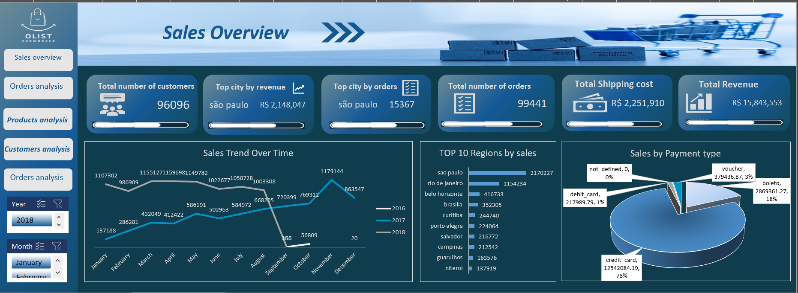
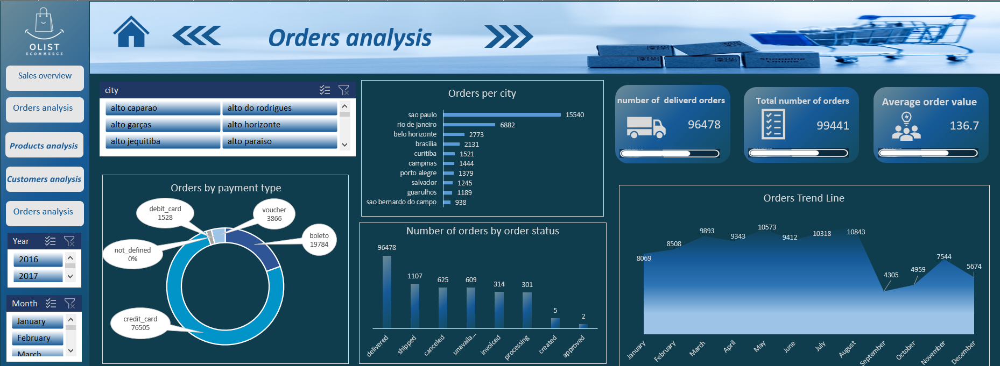
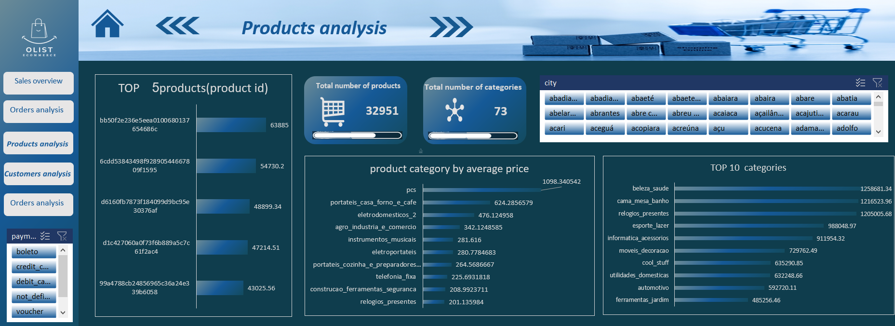
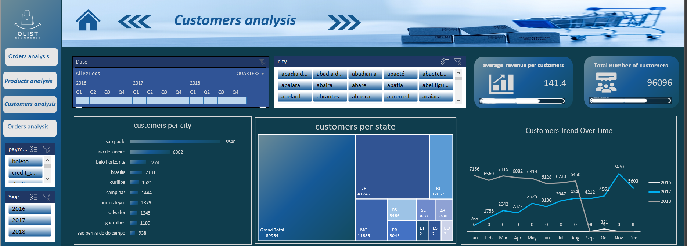

# Olist E-Commerce Dashboard Analysis

A data analysis project on the **Olist dataset** (a Brazilian e-commerce marketplace), built with **Excel Power Pivot** and an interactive, Power BI-style dashboard covering Sales, Orders, Products, and Customers.

## 🛠️ Tools Used
- Excel Power Pivot (data modeling)
- Power Query (data cleaning & transformation)
- DAX (calculated measures)
- PivotTables & PivotCharts (interactive dashboard)

## 📊 Data Model
The project connects multiple related tables into a single data model:
`orders`, `customers`, `order_items`, `products`, `product_category`, `sellers`, `order_payments`, `order_reviews`, `geolocation`, and a `Calendar` table.

## 📈 Dashboard Pages

### 1. Sales Overview
Total revenue, top city by revenue, sales trend over time, top 10 regions, and payment type breakdown.

### 2. Orders Analysis
Orders per city, orders by payment type, order status breakdown, and orders trend line.

### 3. Products Analysis
Top 5 products, total products/categories, average price by category, and top 10 categories by revenue.

### 4. Customers Analysis
Customers per city/state, total customers, average revenue per customer, and customer trend over time.

## 🔍 Key Insights
- **Revenue and customer concentration**: São Paulo dominates in both revenue and customer count, followed by Rio de Janeiro — suggesting an opportunity to grow underrepresented regions.
- **Payment behavior**: Credit card is the dominant payment method (~78% of revenue), followed by boleto (~18%).
- **Data quality note**: Order recording in the dataset stops after September 2018, which causes both the sales and customer trend lines to drop sharply in Q4 2018. This is a **data completeness issue, not a real business decline**, and was excluded from year-over-year interpretation.
- **Correlation vs. causation**: The customer trend line moves almost identically to the sales trend line. This is expected since both metrics are derived from the same `order_purchase_timestamp` field — a strong correlation, but not a causal relationship.
- **Product pricing**: The 'pcs' category has by far the highest average price, despite not being a top revenue category — indicating low sales volume relative to its price point.

## 📁 Repository Contents
| File | Description |
|---|---|
| `olist-project.xlsx` | Full Power Pivot workbook with data model and dashboards |
| `Olist_Dashboards.pptx` | Presentation summary with recommendations |
| `screenshots/` | Dashboard page images |
